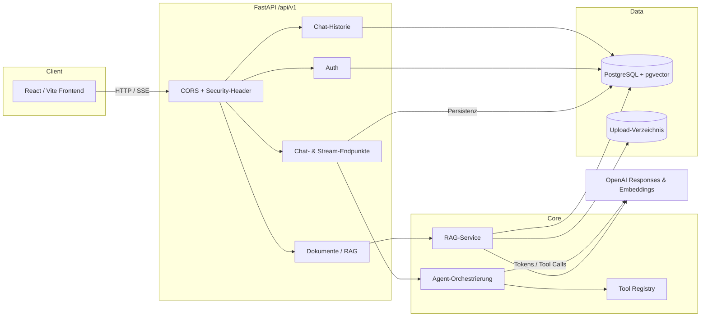
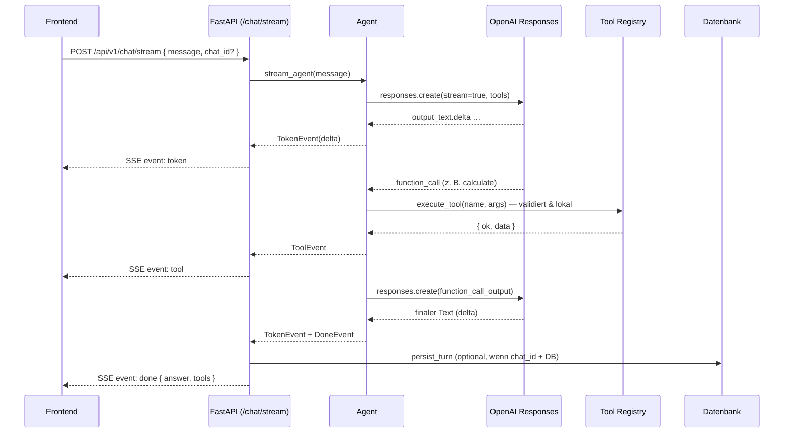
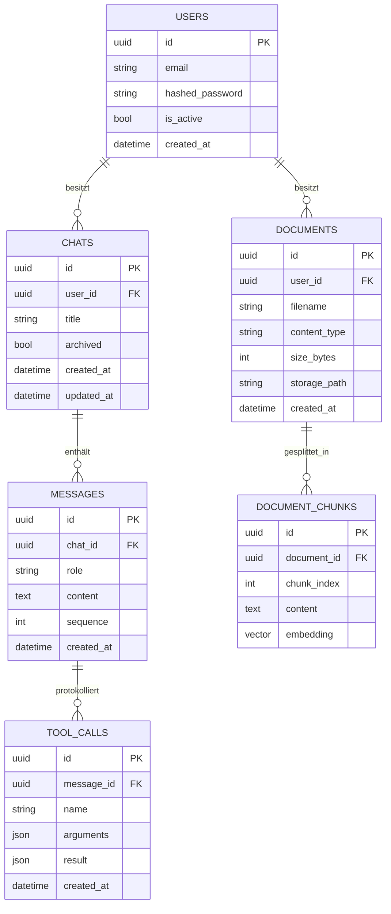

# Nova AI Agent

Eine AI-Agent-Plattform auf Basis der **OpenAI Responses API**
mit Tool Calling, Streaming, Chat-Historie, Retrieval-Augmented
Generation (RAG), JWT-Authentifizierung und einer React-Oberfläche.

Der Agent empfängt eine Nachricht, entscheidet selbst über den Einsatz von
Tools, validiert deren Argumente mit Pydantic, führt sie aus und
erzeugt anschließend eine finale Antwort.

## Feature-Status

| Bereich                             | Status     | Kurzbeschreibung                                                                 |
| ----------------------------------- | ---------- | -------------------------------------------------------------------------------- |
| Tool Calling (Responses API)        | ✅         | Strikte Function Tools, max. Tool-Runden, isolierte Requests                     |
| Streaming (SSE)                     | ✅         | Token-/Tool-/Done-Events, Abbruch, streaming-sichere Middleware                  |
| Tool Registry                       | ✅         | Zentrale Registry (Name, Schema, Kategorie, Rechte, Handler), Auto-Registrierung |
| API-Versionierung + Security-Header | ✅         | `/api/v1`, Legacy-Aliase, ASGI-Security-Header                                   |
| PostgreSQL + SQLAlchemy 2 + Alembic | ✅         | Async-Engine, Migrationen; App startet auch ohne DB                              |
| Chat-Historie                       | ✅         | Chats/Messages/ToolCalls, CRUD, Persistenz der Turns                             |
| Authentifizierung (JWT)             | ✅         | Register/Login/Refresh/Me, argon2-Hashing, User-Scoping                          |
| RAG + pgvector + PDF-Upload         | ✅         | Extraktion→Chunking→Embeddings→Suche mit Quellen                                 |

## Architektur



### Sequenz: Streaming-Chat mit Tool-Call



### Datenbankschema



## Projektstruktur

```
simple-ai-agent/
├── app/
│   ├── main.py            # FastAPI-App, Lifespan, Router, Security-Header, Streaming
│   ├── config.py          # Settings aus Umgebungsvariablen (Fail-fast)
│   ├── schemas.py         # Pydantic Request/Response-Modelle
│   ├── agent.py           # Responses-API-Orchestrierung (run_agent, stream_agent)
│   ├── tools/             # Tool Registry (registry.py) + Built-ins (builtin.py)
│   ├── db/                # Base, Modelle, RAG-Modelle, async Session, Vektortyp
│   ├── services/          # chats, rag, extraction, chunking, embeddings
│   ├── api/               # Router: chats, documents, deps
│   └── auth/              # JWT, Passwort-Hashing, Dependencies, Router
├── migrations/            # Alembic (env.py, versions/)
├── tests/                 # pytest (async SQLite, gemockte OpenAI)
├── frontend/              # React + TypeScript + Vite + Tailwind
├── alembic.ini
├── Dockerfile
└── pyproject.toml
```

## Voraussetzungen

- Python 3.11+
- Node.js 20+ (für das Frontend)
- Ein OpenAI API-Schlüssel
- Optional: PostgreSQL 16 mit pgvector (für Historie, Auth, RAG)

## Installation (Backend)

```powershell
python -m venv .venv
.venv\Scripts\Activate.ps1        # Linux/macOS: source .venv/bin/activate
pip install -e ".[dev]"
```

## Lokaler Start

```powershell
uvicorn app.main:app --reload
```

Erreichbar unter `http://127.0.0.1:8000`, interaktive Doku unter `/docs`.


## Frontend

```powershell
cd frontend
npm install
Copy-Item .env.example .env      # VITE_API_URL -> Backend-URL
npm run dev                      # http://localhost:5173
npm run build                    # Typecheck + Produktions-Build
npm run lint                     # ESLint
```


