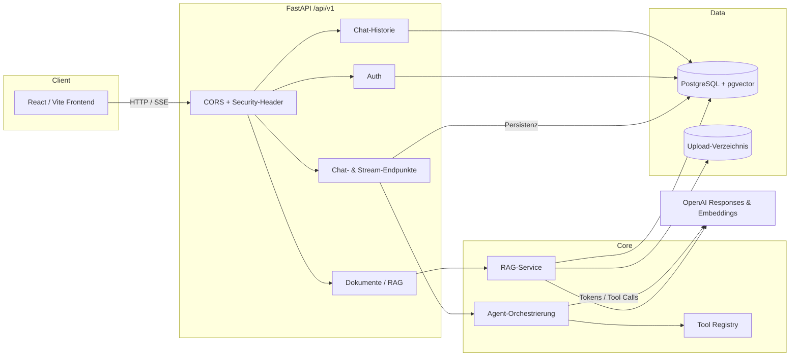
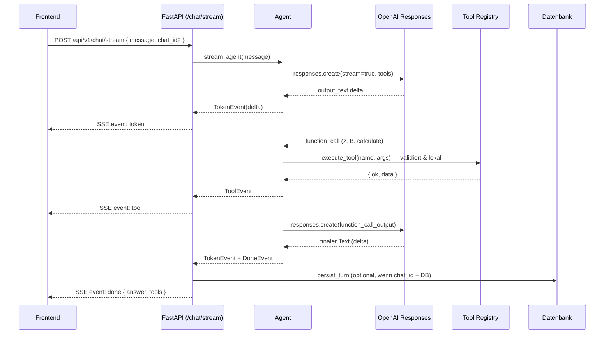
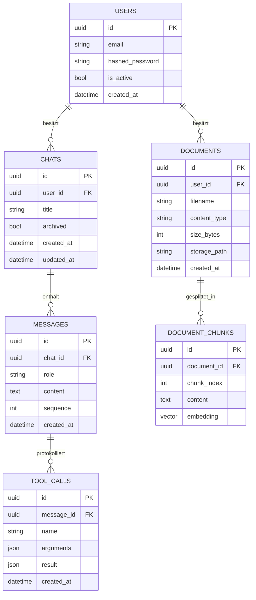

# Nova — AI Automation Platform

Ein AI-Agent-Plattform auf Basis der **OpenAI Responses API**
mit striktem Tool Calling, Streaming, Chat-Historie, Retrieval-Augmented
Generation (RAG), JWT-Authentifizierung und einer React-Oberfläche.

Der Agent empfängt eine Nachricht, entscheidet selbst über den Einsatz von
Tools, validiert deren Argumente strikt mit Pydantic, führt sie lokal aus und
erzeugt anschließend eine finale Antwort.

## Feature-Status

| Bereich                             | Status     | Kurzbeschreibung                                                                 |
| ----------------------------------- | ---------- | -------------------------------------------------------------------------------- |
| Tool Calling (Responses API)        | ✅         | Strikte Function Tools, max. Tool-Runden, isolierte Requests                     |
| Streaming (SSE)                     | ✅         | Token-/Tool-/Done-Events, Abbruch, streaming-sichere Middleware                  |
| Tool Registry                       | ✅         | Zentrale Registry (Name, Schema, Kategorie, Rechte, Handler), Auto-Registrierung |
| API-Versionierung + Security-Header | ✅         | `/api/v1`, Legacy-Aliase, ASGI-Security-Header                                   |
| PostgreSQL + SQLAlchemy 2 + Alembic | ✅         | Async-Engine, Migrationen; App startet auch ohne DB                              |
| Chat-Historie                       | ✅         | Chats/Messages/ToolCalls, CRUD, Persistenz der Turns                             |
| Authentifizierung (JWT)             | ✅         | Register/Login/Refresh/Me, argon2-Hashing, User-Scoping                          |
| RAG + pgvector + PDF-Upload         | ✅         | Extraktion→Chunking→Embeddings→Suche mit Quellen                                 |
| MCP-Client (dynamische Tools)       | 🧭 geplant | Architektur über Registry vorbereitet                                            |
| Observability + Prompt-Management   | 🧭 geplant | Metriken, strukturierte Logs, Correlation-IDs                                    |
| Docker Compose (fe/be/pg/redis)     | 🧭 geplant | Einzelservice-`Dockerfile` vorhanden                                             |
| CI/CD (GitHub Actions)              | 🧭 geplant | Ruff/pytest/Build                                                                |

## Architektur (Überblick)



### Sequenz: Streaming-Chat mit Tool-Call



### Datenbankschema



## Projektstruktur

```
simple-ai-agent/
├── app/
│   ├── main.py            # FastAPI-App, Lifespan, Router, Security-Header, Streaming
│   ├── config.py          # Settings aus Umgebungsvariablen (Fail-fast)
│   ├── schemas.py         # Pydantic Request/Response-Modelle
│   ├── agent.py           # Responses-API-Orchestrierung (run_agent, stream_agent)
│   ├── tools/             # Tool Registry (registry.py) + Built-ins (builtin.py)
│   ├── db/                # Base, Modelle, RAG-Modelle, async Session, Vektortyp
│   ├── services/          # chats, rag, extraction, chunking, embeddings
│   ├── api/               # Router: chats, documents, deps
│   └── auth/              # JWT, Passwort-Hashing, Dependencies, Router
├── migrations/            # Alembic (env.py, versions/)
├── tests/                 # pytest (async SQLite, gemockte OpenAI)
├── frontend/              # React + TypeScript + Vite + Tailwind
├── alembic.ini
├── Dockerfile
└── pyproject.toml
```

## Voraussetzungen

- Python 3.11+
- Node.js 20+ (für das Frontend)
- Ein OpenAI API-Schlüssel
- Optional: PostgreSQL 16 mit pgvector (für Historie, Auth, RAG)

## Installation (Backend)

```powershell
python -m venv .venv
.venv\Scripts\Activate.ps1        # Linux/macOS: source .venv/bin/activate
pip install -e ".[dev]"
```

## Lokaler Start

```powershell
uvicorn app.main:app --reload
```

Erreichbar unter `http://127.0.0.1:8000`, interaktive Doku unter `/docs`.

## Streaming (SSE)

`POST /api/v1/chat/stream` liefert `text/event-stream` mit vier Event-Typen:

| Event   | Daten                         | Bedeutung                    |
| ------- | ----------------------------- | ---------------------------- |
| `token` | `{ "delta": "…" }`            | Ein Stück Assistenztext      |
| `tool`  | `{ name, arguments, result }` | Abgeschlossener Tool-Aufruf  |
| `done`  | `{ answer, tools }`           | Endzustand mit Gesamtantwort |
| `error` | `{ detail }`                  | Sichere Fehlermeldung        |

Die Security-Header werden über eine **reine ASGI-Middleware** gesetzt (nicht
`BaseHTTPMiddleware`), damit der Body nicht gepuffert wird und Streaming
funktioniert. Verbindungsabbrüche propagieren als Cancellation und werden nicht
verschluckt. Das Frontend lässt Nachrichten während der Ausgabe wachsen, zeigt
einen Cursor und erlaubt den Abbruch (`AbortController`).

## Tool Registry

Zentrale Registry in `app/tools/`. Jedes Tool besitzt **Name, Beschreibung,
JSON-Schema, Berechtigungen, Kategorie und Handler**. Tools registrieren sich
per Dekorator selbst – der Agent enthält **keine** Tool-Definitionen.

```python
from app.tools.registry import Permission, ToolCategory, registry

@registry.tool(
    name="calculate",
    description="Führt eine arithmetische Operation aus.",
    category=ToolCategory.MATH,
    parameters=_CALCULATE_SCHEMA,   # striktes JSON-Schema
    args_model=CalculateArgs,       # Pydantic-Validierung
    permissions=(Permission.PUBLIC,),
)
def calculate(args: CalculateArgs) -> dict: ...
```

Built-ins: `calculate` (add/subtract/multiply/divide, Division-durch-null- und
Endlichkeitsprüfung) und `get_current_time` (nur gültige IANA-Zeitzonen via
`zoneinfo`). Die Registry bietet Berechtigungsfilter und `register()` zur
Laufzeit – die Grundlage für dynamische MCP-Tools (geplant).

## RAG (Retrieval-Augmented Generation)

Pipeline: **Upload → Textextraktion → Chunking → Embeddings → pgvector →
semantische Suche → LLM (mit Quellen)**.

- Unterstützte Formate: PDF (`pypdf`), Markdown, TXT.
- Chunking mit Absatzgrenzen und Overlap.
- Embeddings über die OpenAI-Embeddings-API (`EMBEDDING_MODEL`).
- Speicherung als `pgvector`-Vektor auf PostgreSQL, JSON-Fallback auf SQLite.
- Suche liefert Treffer inkl. Quelle (`filename`, `chunk_index`, `score`).

Der Vektortyp adaptiert automatisch je Datenbank. Für große Datenmengen ist der
`pgvector`-Operatorpfad mit HNSW-Cosine-Index in der Migration vorbereitet; die
getestete Retrieval-Logik berechnet die Kosinus-Ähnlichkeit dialektunabhängig.

Endpunkte: `POST /api/v1/documents` (Upload, Drag & Drop im Frontend),
`GET /api/v1/documents`, `DELETE /api/v1/documents/{id}`,
`POST /api/v1/documents/search`.

## Authentifizierung (JWT)

Aktiv, sobald `JWT_SECRET_KEY` gesetzt ist. Passwörter werden mit **argon2**
(`pwdlib`) gehasht; Tokens mit **PyJWT** signiert.

| Endpunkt                     | Zweck                              |
| ---------------------------- | ---------------------------------- |
| `POST /api/v1/auth/register` | Registrierung (201)                |
| `POST /api/v1/auth/login`    | Access- + Refresh-Token            |
| `POST /api/v1/auth/refresh`  | Neues Token-Paar aus Refresh-Token |
| `GET /api/v1/auth/me`        | Aktuelles Profil (Bearer-Token)    |
| `POST /api/v1/auth/logout`   | Client verwirft Tokens (204)       |

Chats und Dokumente werden bei aktiver Authentifizierung pro Benutzer
gescopet; ohne Token gilt anonymer Modus (Ressourcen ohne Besitzer).

## API-Referenz (`/api/v1`)

Alle Endpunkte sind unter `/api/v1` versioniert; die unversionierten Pfade
(`/health`, `/chat`, `/chat/stream`) bleiben als Aliase erhalten.

| Methode | Pfad                                                    | Zweck                                |
| ------- | ------------------------------------------------------- | ------------------------------------ |
| GET     | `/health`                                               | Status + konfiguriertes Modell       |
| POST    | `/chat`                                                 | Nicht-gestreamte Antwort             |
| POST    | `/chat/stream`                                          | Gestreamte Antwort (SSE)             |
| POST    | `/chats`                                                | Chat anlegen                         |
| GET     | `/chats`                                                | Chats auflisten (`include_archived`) |
| GET     | `/chats/{id}`                                           | Chat mit Nachrichten                 |
| PATCH   | `/chats/{id}`                                           | Umbenennen / archivieren             |
| DELETE  | `/chats/{id}`                                           | Chat löschen                         |
| POST    | `/auth/register` \| `/login` \| `/refresh` \| `/logout` | Authentifizierung                    |
| GET     | `/auth/me`                                              | Profil                               |
| POST    | `/documents`                                            | Datei hochladen + einbetten          |
| GET     | `/documents`                                            | Dokumente auflisten                  |
| DELETE  | `/documents/{id}`                                       | Dokument löschen                     |
| POST    | `/documents/search`                                     | Semantische Suche                    |

Beispiel:

```bash
curl -X POST http://127.0.0.1:8000/api/v1/chat \
  -H "Content-Type: application/json" \
  -d '{"message": "Was ist 145 geteilt durch 5?"}'
```

## Datenbank & Migrationen

Async SQLAlchemy 2.x mit Alembic. Modelle unter `app/db/`.

```powershell
# Migrationen anwenden (DATABASE_URL muss gesetzt sein)
alembic upgrade head

# Neue Migration aus Modelländerungen erzeugen
alembic revision --autogenerate -m "beschreibung"
```

Ohne `DATABASE_URL` startet die App weiterhin; Tests nutzen async-SQLite
(`aiosqlite`) über `Base.metadata.create_all`.

## Frontend

```powershell
cd frontend
npm install
Copy-Item .env.example .env      # VITE_API_URL -> Backend-URL
npm run dev                      # http://localhost:5173
npm run build                    # Typecheck + Produktions-Build
npm run lint                     # ESLint
```

Stack: React + TypeScript + Vite + Tailwind CSS + shadcn/ui-Komponenten +
Lucide Icons, Dark Mode als Standard. Features: Streaming mit Cursor & Stop,
Markdown mit Syntax-Highlighting und Copy-Button, einklappbare Tool-Call-
Visualisierung, Chat-Historie (Sidebar), Dokumenten-Upload per Drag & Drop mit
Fortschritt und Live-Verbindungsstatus.

## Tests, Ruff, Typprüfung

```powershell
pytest                 # Backend-Tests (ohne echte OpenAI-Anfragen, DB via SQLite)
ruff check .           # Linting
npm --prefix frontend run build   # Frontend Typecheck + Build
npm --prefix frontend run lint    # ESLint
```

## Docker & Deployment

Ein schlankes, nicht als Root laufendes Backend-Image liegt bei:

```powershell
docker build -t nova-backend .
docker run --rm -p 8000:8000 --env-file .env nova-backend
```

Ein vollständiges `docker compose`-Setup (Frontend, Backend, PostgreSQL/pgvector,
Redis) inklusive Healthchecks ist geplant (siehe Feature-Status). Bis dahin
lassen sich Backend und Frontend wie oben beschrieben getrennt starten; für
Historie/Auth/RAG wird eine erreichbare PostgreSQL-Instanz mit `pgvector`
benötigt.

